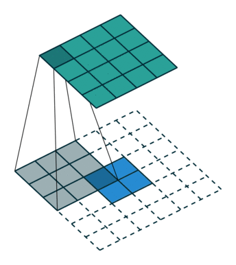

居中渲染

### 20180701
#### PRML P41\~P42 (1.80) (1.81) P63\~P64 1.23 1.24 
$$\begin{aligned}
\mathrm{E}[L]&=\sum_k\sum_j\int_{R_j}L_{kj}p(\mathcal{C}_k,x)dx\\
&\color{red}{=\mathrm{E}_x\left[\sum_k\sum_jL_{kj}p(\mathcal{C}_k|x)\right]}(\rm This\ is\ wrong!)
\end{aligned}$$$$j=\arg\min_l\sum_kL_{kl}p(\mathcal{C}_k|x)$$$$decision=\left\{\begin{aligned}
&class\ j,\ if\ \min_l\sum_kL_{kl}p(\mathcal{C}_k|x)<\lambda;\\
&reject,\ other.
\end{aligned}\right.$$when $L=1-I$ , $\theta=?$

### 20180703
#### 统计学习方法 P16 定理1.1
对应二分类问题，有限函数的集合$\mathcal{F}=\{f_1,f_2,\cdots,f_d\}$ , $$P(R(f)\leqslant\hat{R}(f)+\varepsilon(d,N,\delta))\geqslant1-\delta\tag{1.25}$$$$\varepsilon=\sqrt{\frac{1}{2N}(\log d+\log\frac{1}{\delta})}\tag{1.26}$$Hoeffding不等式。设 $\mathrm{S}_n=\sum^n_i\mathrm{X}_i$ , 其中 $\mathrm{X}_1,\mathrm{X}_2,\cdots,\mathrm{X}_n$ 相互独立 , $\mathrm{X}_i\in[a_i,b_i]$ , 有以下不等式 ,$$P(\mathrm{S}_n-\mathrm{E}\mathrm{S}_n\geqslant t)\leqslant\exp\left(-\frac{2t^2}{\sum^n_i(b_i-a_i)^2}\right)\tag{1.27}$$$$P(\mathrm{E}\mathrm{S}_n-\mathrm{S}_n\geqslant t)\leqslant\exp\left(-\frac{2t^2}{\sum^n_i(b_i-a_i)^2}\right)\tag{1.28}$$
### 20180704
#### Stochastic approximation with two time scales P3
$$\dot{z}(t)=h(z(t))\tag{2.1}$$for a Lipschitz $h:R^N\rightarrow R^N$ , such that $(2.1)$ has a globel stable attractor $J$. Given $T$, $\delta>0$ , call a bounded measurable $y(\cdot):R^+\rightarrow R^N$ a $(T,\delta)$-perturbation of $(2.1)$ if there exist $0=T_0<T_1<T_2<\cdots T_n\uparrow\infty$ with $T_{i+1}-T_i\geqslant T$ and solutions $z^j(t)$ , $t\in[T_j,T_{j+1}]$ of $(2.1)$ for $j\geqslant0$ , such that $$\sup_{t\in[T_j,T_{j+1}]}\|z^j(t)-y(t)\|<\delta.$$$\textbf{Lemma 2.1.}$ Given $\varepsilon,T>0$, there exists a $\bar{\delta}>0$ such that for $\delta\in(0,\bar{\delta})$, every $(T,\delta)$-perturbation of $(2.1)$ converges to $J^\varepsilon(\ \overset{\Delta}{=}\ the\ \varepsilon-neighbourhood\ of\ J)$.

### 20180705
#### gradient of $C(G(z))$ in RGAN
$$\begin{aligned}
\nabla_{\theta}C(G(z))&=\left[\begin{array}{cccc}\sum^d_i\frac{\partial C}{\partial x_i}\frac{\partial G_i}{\partial \theta_1}&\sum^d_i\frac{\partial C}{\partial x_i}\frac{\partial G_i}{\partial \theta_2}&\cdots&\sum^d_i\frac{\partial C}{\partial x_i}\frac{\partial G_i}{\partial \theta_d}\end{array}\right]\\
&=\left[\begin{array}{cccc} \frac{\partial C}{\partial x_1} & \frac{\partial C}{\partial x_2} & \cdots & \frac{\partial C}{\partial x_d}
\end{array}\right]\left[\begin{array}{cccc}\frac{\partial G_1}{\partial \theta_1}&\frac{\partial G_1}{\partial \theta_2}&\cdots&\frac{\partial G_1}{\partial \theta_d}\\
\frac{\partial G_2}{\partial \theta_1}&\frac{\partial G_2}{\partial \theta_2}&\cdots&\frac{\partial G_2}{\partial \theta_d}\\
\vdots&\vdots&\ddots&\vdots\\
\frac{\partial G_d}{\partial \theta_1}&\frac{\partial G_d}{\partial \theta_2}&\cdots&\frac{\partial G_d}{\partial \theta_d}
\end{array}\right]\\
&=\nabla_xC(G(z))J_\theta G(z)\end{aligned}$$
#### $L_{out}$ of Conv in pytorch
$$L_{out}=\left\lfloor\frac{L_{in}\rm+2*padding-dilation*(kernel\_size-1)-1}{\rm stride}+1\right\rfloor$$参数为 $(i=4\times4,k=3\times3,s=1\times1,p=0)$ , 输出 $o=2\times2$ .$$\left[\begin{array}{cccc}w_{00}&w_{01}&w_{02}&0\\
w_{10}&w_{11}&w_{12}&0\\
w_{20}&w_{21}&w_{22}&0\\
0&0&0&0
\end{array}\right]$$拉成 $16\times4$$$\left[\begin{array}{cccccccccccccccc}w_{00}&w_{01}&w_{02}&0&w_{10}&w_{11}&w_{12}&0&w_{20}&w_{21}&w_{22}&0&0&0&0&0\\
0&w_{00}&w_{01}&w_{02}&0&w_{10}&w_{11}&w_{12}&0&w_{20}&w_{21}&w_{22}&0&0&0&0\\
0&0&0&0&w_{00}&w_{01}&w_{02}&0&w_{10}&w_{11}&w_{12}&0&w_{20}&w_{21}&w_{22}&0\\
0&0&0&0&0&w_{00}&w_{01}&w_{02}&0&w_{10}&w_{11}&w_{12}&0&w_{20}&w_{21}&w_{22}\\\end{array}\right]$$再把 $4\times4$ 的输入特征展成 $[16,1]$ 的矩阵 $X$，那么 $Y=CX$ 则是一个 $[4,1]$ 的输出特征矩阵.
#### $L_{out}$ of Deconv in pytorch
$$L_{out}=(L_{in}-1)*\rm stride-2*padding+kernel\_size+output\_padding$$
#### Fractionally Convolution $(i=4,k=3,s=1,p=0)$
$$\left[\begin{array}{cc}w_{00}&0\\
0&0
\end{array}\right],\left[\begin{array}{cc}w_{01}&w_{00}\\
0&0
\end{array}\right],\left[\begin{array}{cc}w_{02}&w_{01}\\
0&0
\end{array}\right],\left[\begin{array}{cc}0&w_{02}\\
0&0
\end{array}\right]$$$$\left[\begin{array}{cccc}
w_{00}&0&0&0\\
w_{01}&w_{00}&0&0\\
w_{02}&w_{01}&0&0\\
0&w_{02}&0&0\\
w_{10}&0&w_{00}&0\\
w_{11}&w_{10}&w_{01}&w_{00}\\
w_{12}&w_{11}&w_{02}&w_{01}\\
0&w_{12}&0&w_{02}\\
w_{20}&0&w_{10}&0\\
w_{21}&w_{20}&w_{11}&w_{10}\\
w_{22}&w_{21}&w_{12}&w_{11}\\
0&w_{22}&0&w_{12}\\
0&0&w_{20}&0\\
0&0&w_{21}&w_{20}\\
0&0&w_{22}&w_{21}\\
0&0&0&w_{22}\end{array}\right]$$再把 $2\times2$ 的矩阵展成 $[4,1]$ 的矩阵 $Y$ , 那么 $X=C^{\rm T}Y$ 是 $[16,1]$ 的矩阵。$(C$为上面 Conv 中的$C)$

#### Fractionally Strided Convolution $(i=5,k=3,s=2,p=1)$
$$\left[\begin{array}{ccccccccc}
w_{11}&0         &0         &0         &0         &0         &0         &0         &0\\
w_{12}&w_{10}&0         &0         &0         &0         &0         &0         &0\\
0         &w_{11}&0         &0         &0         &0         &0         &0         &0\\
0         &w_{12}&w_{10}&0         &0         &0         &0         &0         &0\\
0         &0         &w_{11}&0         &0         &0         &0         &0         &0\\
w_{21}&0         &0         &w_{01}&0         &0         &0         &0         &0\\
w_{22}&w_{20}&0         &w_{02}&w_{00}&0         &0         &0         &0\\
0         &w_{21}&0         &0         &w_{01}&0         &0         &0         &0\\
0         &w_{22}&w_{20}&0         &w_{02}&w_{00}&0         &0         &0\\
0         &0         &w_{21}&0         &0         &w_{01}&0         &0         &0\\
0         &0         &0         &w_{10}&0         &0         &0         &0         &0\\
0         &0         &0         &w_{11}&w_{10}&0         &0         &0         &0\\
0         &0         &0         &0         &w_{11}&0         &0         &0         &0\\
0         &0         &0         &0         &w_{12}&w_{10}&0         &0         &0\\
0         &0         &0         &0         &0         &w_{11}&0         &0         &0\\
0         &0         &0         &w_{20}&0         &0         &w_{01}&0         &0\\
0         &0         &0         &w_{21}&w_{20}&0         &w_{02}&w_{00}&0\\
0         &0         &0         &0         &w_{21}&0         &0         &w_{01}&0\\
0         &0         &0         &0         &w_{22}&w_{20}&0         &w_{02}&w_{00}\\
0         &0         &0         &0         &0         &w_{21}&0         &0         &w_{01}\\
0         &0         &0         &0         &0         &0         &w_{11}&0         &0\\
0         &0         &0         &0         &0         &0         &w_{12}&w_{10}&0\\
0         &0         &0         &0         &0         &0         &0         &w_{11}&0\\
0         &0         &0         &0         &0         &0         &0         &w_{12}&w_{10}\\
0         &0         &0         &0         &0         &0         &0         &0         &w_{11}\\
\end{array}\right]$$$(i=7,k=3,s=2,p=0)$ ?
